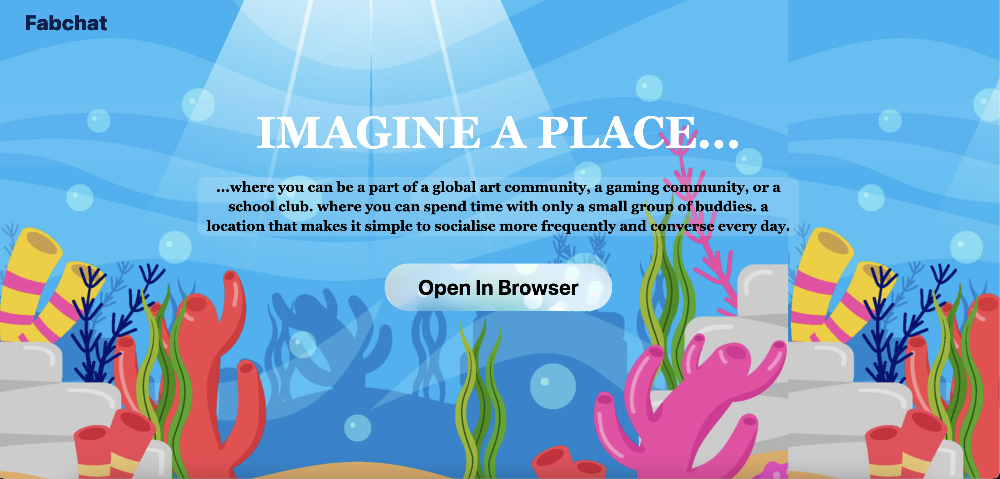
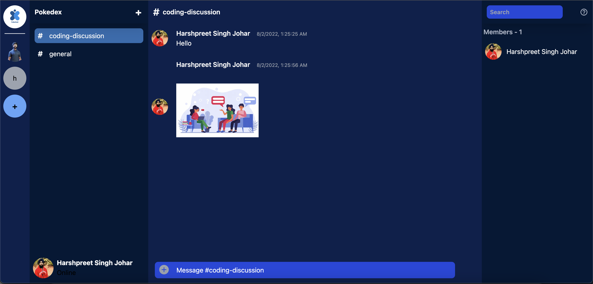

# FabChat
Fabchat is a VoIP and instant messaging social platform. Create servers, create channels, talk on voice chat/real time messaging. 

Built using NEXTjs, Firebase, twilio and Expressjs.
## Features
+ Create Servers 
    + Communities to build with friends/people with similar interest.
+ Create channels in servers
    + Different chats for different topics/discussions in a single server.
+ Real time messaging
    + Text channels
    + Send images
+ VOIP/Voice Chat
    + Voice channels
+ Direct messaging
    + Voice chat
    + Text chat

## Implementation
Features are implemented using the following technologies
### Servers and channels
These are stored inside the firebase firestore database.

### Real time messaging
Firestore database is a real time databse provided by firebase(google). Users can send images or text in the messages.

Users can also text single users(direct messaging) on this platform.

### VOIP
Users can have voice chats in the servers(supports upto 25 people at once in a channel) or direct calling a single user.

## Snapshots

